# Udacity Azure DevOps

## Ensuring Quality Releases
Please fork the repository and integrate it into Azure DevOps. Please setup the standard pipeline [azure-pipelines.yaml](azure-pipelines.yaml) to proceed with any further steps.

### Infrastructure Setup

1. Create Azure Service Principal for the Terraform Infrastructure Deployment. The Service Principal must have at least Contributor RBAC assignment for the newly created Resource Group. For further details please refer to [Create Service Principal](https://www.terraform.io/docs/providers/azurerm/guides/service_principal_client_secret.html). You can add them to your terraform.tfvars file, but never push this to the remote repository. Instead add the file as secret file to Azure Pipelines. This gets used later on in the pipeline. 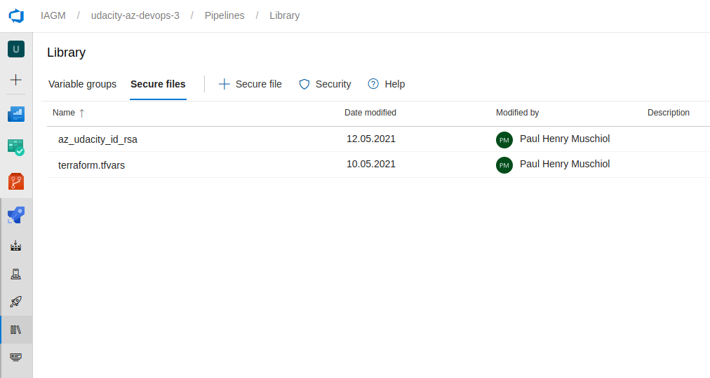

2. Create Storage Account for terraform state. This does not necessarily must be in the same resource group as the other resources. For details please refer to [Create State backend](https://docs.microsoft.com/en-us/azure/terraform/terraform-backend). An example can be found in [Terraform template](terraform/environments/terraform.tfvars.template) Please store the information for the terraform storage in pipeline variables.
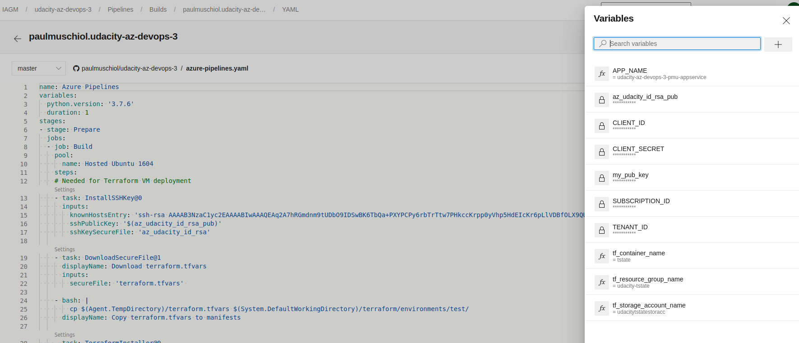

3. Create an RSA key pair using `ssh-keygen -m PEM -t rsa -b 4096`. Put the private file as secure file into the Library and the pub key phrase as pipeline variable.

4. Create a service principal `udacity-az-devops-3-sc` that can access the storage account in Azure DevOps. For details please refer to [Create Pipeline Service Principal](https://docs.microsoft.com/en-us/azure/devops/pipelines/library/connect-to-azure?view=azure-devops).

5. Run the Prepare stage of the pipeline to create the resources with Terraform. This brings up all the resources defined for the environment. 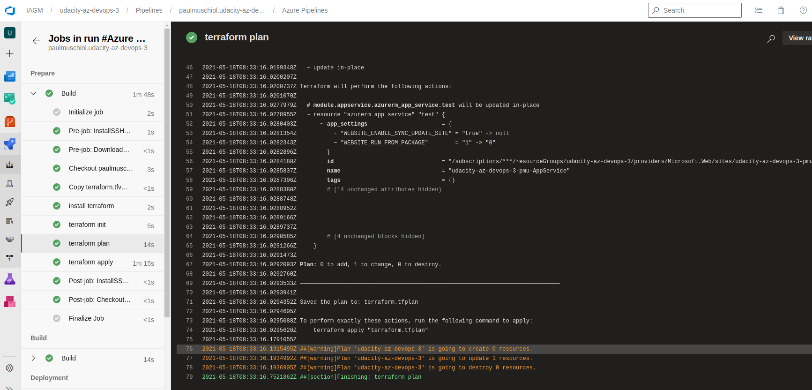 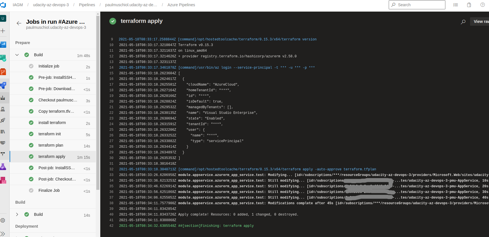

6. Create an environment in Azure DevOps named `TEST`. Please register the VM created by terraform to it and set a tag `default` to it. For details please follow the instructions here [Setup Envitronment](https://docs.microsoft.com/en-us/azure/devops/pipelines/ecosystems/deploy-linux-vm?view=azure-devops&tabs=java). You can ssh into the VM using the private key created earlier.
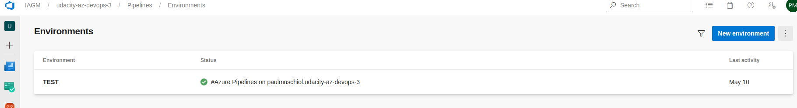

### CI Testing

#### API Testing Postman

The Postman regression and validation testing scripts can be found in [automatedtesting/postman/](automatedtesting/postman/). They perform tests against the dummy API `http://dummy.restapiexample.com`. They start automatically within the pipeline in the test step. 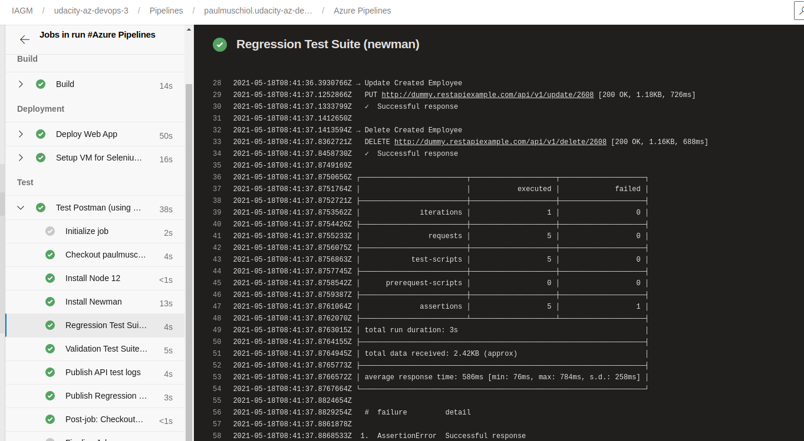 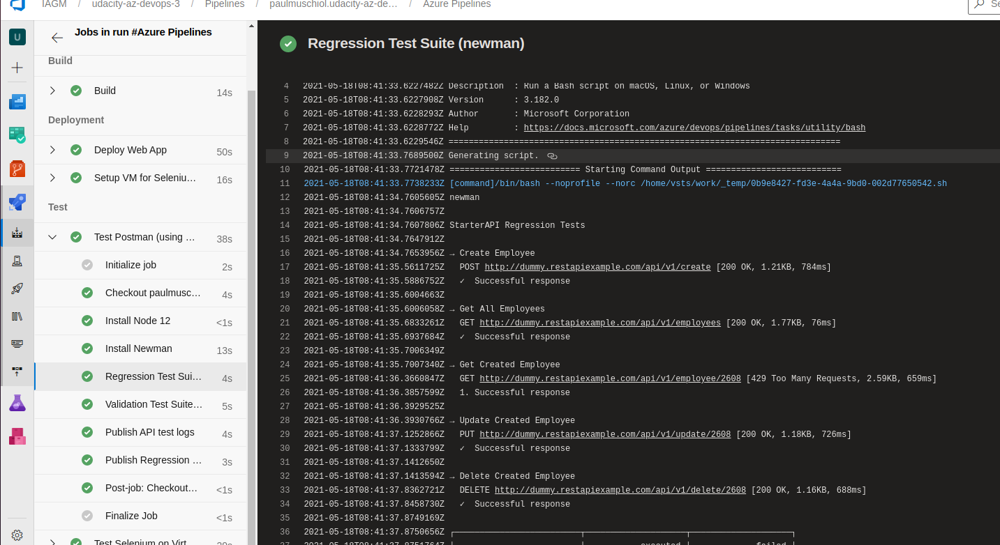

Logs get stored in a pipeline artifact that can be downloaded. Please be aware that it is unlikely that all tests pass as the API is highly unstable and often return just a 429 error. 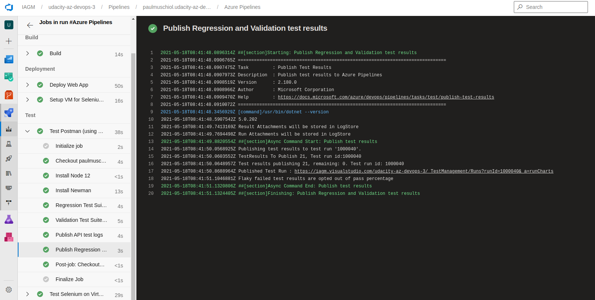

#### Performance Testing

#### UI Testing Selenium

The UI testing is performed on the provided VM by running a python script. The python script gets moved to the VM as artifact beforehand. It logs in, adds all items to the cart and then removed them. 
The data can be consumed by log analytics as well.
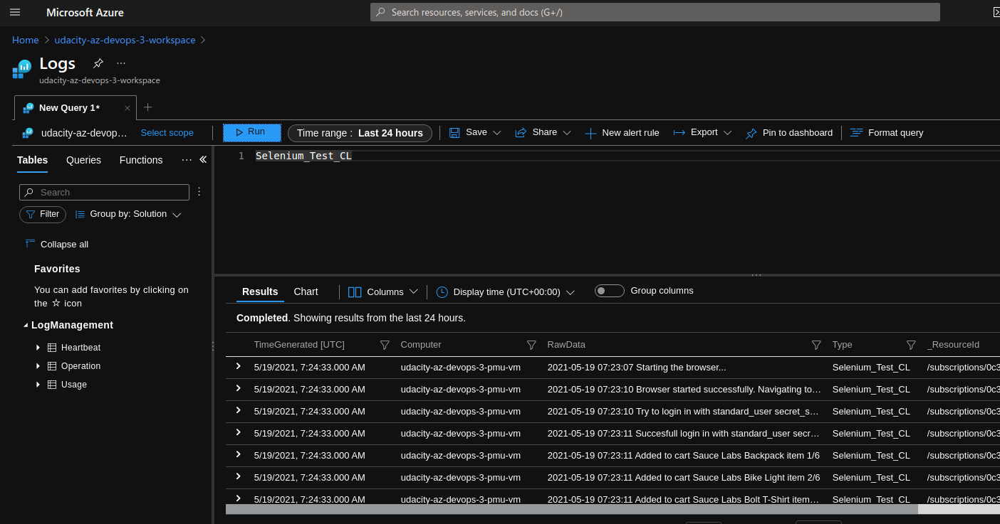

### Monitoring

1. Navigate to the Azure Portal and open your AppService created by terraform. Go to alerts and configure a new Alert Rule. For example I configured to tirgger an infomral alert whenever the AppService exceeds 300kb outgoing traffic. The rule is configured to send an email. 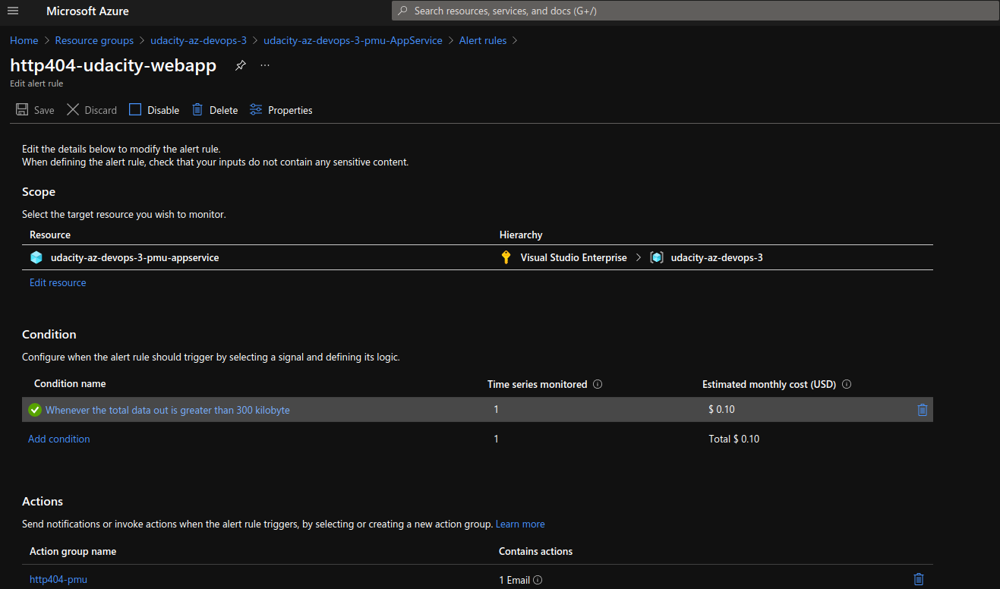

2. Create a Azure log analytics workspace. You can do this in Azure Portal or using the provided script. You can find the shell template from the micorsoft page already here. First source [udacity-az-devops-3-pmu-appservice.env](udacity-az-devops-3-pmu-appservice.env), then execute the shell file [create_log_analytics_workspace.sh](create_log_analytics_workspace.sh). Please refer for further details to the offical Microsoft documentation [Azure Log Analytics Workspace](https://docs.microsoft.com/en-us/azure/azure-monitor/logs/quick-create-workspace). 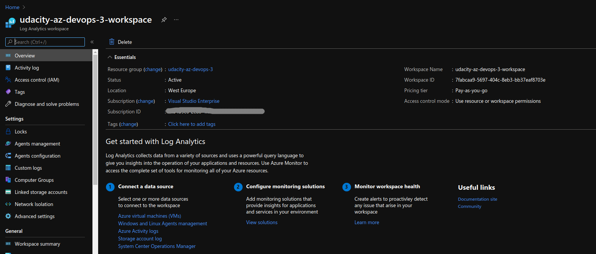

3. Link your VM with your log workspace. This can be done in agents management section. Just copy the registration command and execute it directly on the VM. 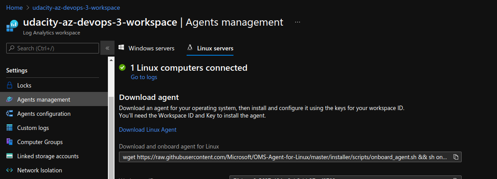.

4. Go to the advanced settings section of your log workspace. Please configure here the selenium logs to be retrieved from the VM. The files are stored on the VM under `/var/log/selenium` and are separated by new line. 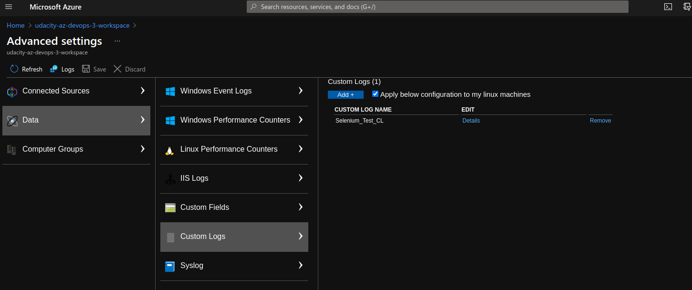. You should now see the logs written by selenium in `/var/log/selenium/*` directly in log analytics and query them. [Custom Data Log](https://docs.microsoft.com/en-us/azure/azure-monitor/agents/data-sources-custom-logs) 